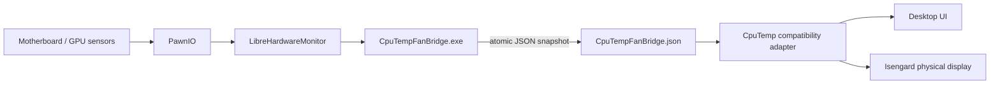

# Isengard Sensor Bridge

> A standalone, reversible sensor bridge for the SuperFrame Isengard display and CpuTemp 1.0.15—built because an 8,000 RPM “fan” and a missing pump reading were too ridiculous to ignore.

[](https://www.microsoft.com/windows/)
[](https://dotnet.microsoft.com/)
[](LICENSE)
[](https://github.com/namazso/PawnIO)

Modern AM5 motherboards can expose sensor chips that the HWiNFO SDK bundled with CpuTemp 1.0.15 does not understand. On the tested GIGABYTE X870E AORUS PRO, the old backend identified the ITE IT8696E as an unrelated legacy controller and produced a changing 6,000–8,000 RPM phantom reading.

This project leaves the original application available for rollback, reads current hardware values through LibreHardwareMonitor + PawnIO, and feeds only the corrected values into CpuTemp.

## What you get

| CpuTemp / display field | Supplied value |
|---|---|
| CPU Fan Speed | Real CPU fan tachometer in RPM |
| CPU Frequency | CPU average core clock in MHz |
| Pump Speed numeric field | CPU average core clock (intentional repurpose) |
| GPU Frequency | Selected discrete GPU core clock in MHz |
| GPU Fan Speed | Selected GPU fan tachometer; 0 RPM remains valid |

The physical display firmware still labels the repurposed CPU-clock field **Pump Speed** and appends **RPM**. The bridge changes the number, not firmware-rendered text.

## Architecture



No HWiNFO process, network service, telemetry, or cloud account is required at runtime.

## Compatibility

The release installer intentionally refuses unknown application builds.

- Windows 11 x64
- CpuTemp / Smart CpuTemp **1.0.15**
- Supported original `app.asar` SHA-256: `89FA5F06715620AD5F8208ECA18229A3242A0FF3165D3067AF40FA7B73EFCD57`
- Fan Control **v273 or newer**, with working motherboard sensors
- PawnIO **2.2.0 or newer** (normally supplied by Fan Control)
- Tested motherboard: GIGABYTE X870E AORUS PRO / ITE IT8696E
- Tested GPU: NVIDIA GeForce RTX 4090

GPU discovery supports LibreHardwareMonitor's NVIDIA, AMD, and Intel GPU groups. Discrete GPUs with fan sensors are preferred automatically. Hardware not listed above should be treated as community-tested until reported.

## Quick start

1. Install [Fan Control](https://github.com/Rem0o/FanControl.Releases) v273 or newer.
2. Open Fan Control once and confirm that motherboard sensors are visible.
3. Download the latest `CpuTempStandaloneFix.zip` from [Releases](https://github.com/brunocarlin/isengard-sensor-bridge/releases/latest).
4. Verify the release checksum, extract the ZIP, and exit CpuTemp from its tray icon.
5. Run `Install.cmd` and approve the UAC prompt.
6. Open `CpuTemp.exe` normally after the installer finishes.

The installer:

- verifies all supported-build and payload SHA-256 hashes;
- makes an exact rollback backup before patching;
- installs the elevated bridge under administrator-protected `Program Files\CpuTempSensorBridge`;
- registers a highest-privilege, current-user logon task;
- writes sensor data atomically to CpuTemp's `lib` directory;
- never launches CpuTemp as administrator.

## Choosing the GPU

The default scoring prefers a GPU with fan sensors, then NVIDIA, AMD, and Intel hardware groups. To override that choice, create `CpuTempFanBridge.config.json` in CpuTemp's `lib` directory:

```json
{
  "PreferredGpu": "Radeon RX 7900 XTX"
}
```

`PreferredGpu` is a case-insensitive substring of the LibreHardwareMonitor hardware name. Restart the **CpuTemp Standalone Sensor Bridge** scheduled task after editing it.

For laptops and unusual multi-GPU systems, run the bridge with `--list-lhm-file sensors.txt` from an elevated terminal to discover exact names and sensor identifiers.

## Changing what is displayed

CpuTemp uses fixed HWiNFO-style sensor keys. The compatibility adapter in [`compat/binding.js`](compat/binding.js) maps bridge JSON fields to those keys.

Important boundaries:

- Keep CPU clock keys inside CPU groups.
- Keep `GPU Clock` inside GPU groups; CpuTemp may select an integrated GPU group first.
- Mirroring `Fan CPU` is safe because it cannot be mistaken for a clock.
- The physical labels and units appear firmware-defined and cannot currently be changed safely.
- Never remove the exact-build hash gate merely to support a newer CpuTemp release; analyze and add that build explicitly.

The repository includes the reusable [`adapt-isengard-sensors`](skills/adapt-isengard-sensors/SKILL.md) Codex skill for GPU adaptation and display-mapping work.

## Rollback

Exit CpuTemp and run `Restore.cmd` as administrator. It unregisters the bridge task, removes bridge files, verifies the backup, and restores the exact original `app.asar`. Fan Control and PawnIO are left untouched.

## Build from source

Install the .NET 10 SDK, then:

```powershell
dotnet publish .\src\CpuTempFanBridge\CpuTempFanBridge.csproj `
  -c Release -r win-x64 --self-contained true `
  -p:PublishSingleFile=true -o .\artifacts\bridge
```

The bridge is built as `WinExe`, so its persistent watcher does not leave a console window open.

## Troubleshooting

### Values remain at zero

- Confirm `lib\CpuTempFanBridge.status` starts with `OK:`.
- Confirm `lib\CpuTempFanBridge.json` changes every second.
- Confirm PawnIO 2.2.0+ is installed and Fan Control can read sensors.
- Exit every CpuTemp process before reinstalling the patch.

### GPU frequency comes from the wrong GPU

Set `PreferredGpu` as shown above. GPU clocks naturally fall to a few hundred MHz at idle and rise under load.

### Windows shows a black bridge window

Install the current release. Early development builds used a console subsystem; current builds run without a visible window.

### Installer rejects `app.asar`

Do not bypass the check. Open an issue with the CpuTemp version and SHA-256 hash so the build can be analyzed safely.

## Security

Read [SECURITY.md](SECURITY.md) before changing task paths or integrity checks. The scheduled task requires elevation for hardware access; its executable therefore lives under `Program Files`, not a user-writable download directory.

## Legal and acknowledgements

This is an independent community compatibility project. It is not affiliated with or endorsed by SuperFrame, Terabyte, HWiNFO, Fan Control, LibreHardwareMonitor, PawnIO, AMD, NVIDIA, Intel, or GIGABYTE. Product names are used only to describe interoperability.

No CpuTemp application archive, HWiNFO DLL, PawnIO installer, or vendor firmware is included in this repository. Users must obtain the original software and prerequisites from their respective publishers.

Original project code is MIT licensed. LibreHardwareMonitor is MPL-2.0; see [`licenses/`](licenses/) and its [upstream project](https://github.com/LibreHardwareMonitor/LibreHardwareMonitor).

Built from a very real debugging session, several misleading tachometer readings, and a refusal to accept `0 MHz` as an answer.
