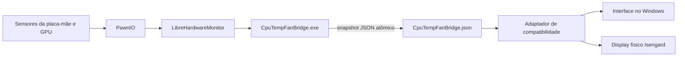

# Isengard Sensor Bridge

[English](README.md) · [Português (Brasil)](README.pt-BR.md)

> Uma ponte de sensores independente e reversível para o display do SuperFrame Isengard e o CpuTemp 1.0.15 — criada porque uma “fan” marcando 8.000 RPM e uma bomba desaparecida não dava para aceitar.

[](https://www.microsoft.com/windows/)
[](https://dotnet.microsoft.com/)
[](LICENSE)
[](https://github.com/namazso/PawnIO)

Placas-mãe AM5 modernas podem usar controladores de sensores que o SDK antigo do HWiNFO incluído no CpuTemp 1.0.15 não reconhece corretamente. Na GIGABYTE X870E AORUS PRO testada, o programa confundia o ITE IT8696E com um controlador legado e mostrava uma leitura fantasma variando entre 6.000 e 8.000 RPM.

Este projeto mantém uma cópia verificável do aplicativo original para restauração, lê os sensores atuais por meio do LibreHardwareMonitor + PawnIO e entrega apenas os valores corrigidos ao CpuTemp.

## O que ele corrige

| Campo no CpuTemp/display | Valor fornecido |
|---|---|
| Velocidade da fan da CPU | Leitura real do tacômetro em RPM |
| Frequência da CPU | Clock médio dos núcleos em MHz |
| Valor numérico de Pump Speed | Clock médio da CPU em MHz (reaproveitamento intencional) |
| Frequência da GPU | Clock do núcleo da GPU selecionada em MHz |
| Velocidade das fans da GPU | Tacômetro real; 0 RPM continua válido |

O firmware do display físico ainda chama o campo reaproveitado de **Pump Speed** e acrescenta a unidade **RPM**. A ponte altera o número enviado, não os textos renderizados pelo firmware.

## Como funciona



Não é necessário manter o HWiNFO aberto. A ponte não possui serviço de rede, telemetria nem integração com nuvem.

## Compatibilidade

O instalador recusa propositalmente versões desconhecidas do aplicativo.

- Windows 11 x64
- CpuTemp / Smart CpuTemp **1.0.15**
- SHA-256 do `app.asar` original suportado: `89FA5F06715620AD5F8208ECA18229A3242A0FF3165D3067AF40FA7B73EFCD57`
- Fan Control **v273 ou mais recente**, com os sensores da placa-mãe funcionando
- PawnIO **2.2.0 ou mais recente**, normalmente instalado pelo Fan Control
- Placa-mãe testada: GIGABYTE X870E AORUS PRO / ITE IT8696E
- GPU testada: NVIDIA GeForce RTX 4090

A descoberta de GPU reconhece grupos NVIDIA, AMD e Intel expostos pelo LibreHardwareMonitor. Por padrão, uma GPU dedicada com tacômetros de fan recebe prioridade. Hardware diferente do listado acima ainda precisa de validação pela comunidade.

## Instalação rápida

1. Instale o [Fan Control](https://github.com/Rem0o/FanControl.Releases) v273 ou mais recente.
2. Abra o Fan Control uma vez e confirme que ele consegue ler os sensores da placa-mãe.
3. Baixe o `CpuTempStandaloneFix.zip` mais recente em [Releases](https://github.com/brunocarlin/isengard-sensor-bridge/releases/latest).
4. Confira o SHA-256 publicado, extraia o ZIP e feche o CpuTemp pelo ícone ao lado do relógio.
5. Execute `Install.cmd` e aceite a solicitação do UAC.
6. Quando terminar, abra o CpuTemp normalmente — sem “Executar como administrador”.

O instalador:

- verifica o SHA-256 da versão do CpuTemp e dos arquivos da correção;
- cria um backup exato antes de alterar qualquer coisa;
- instala a ponte elevada em `Program Files\CpuTempSensorBridge`, protegida contra substituição por usuário comum;
- registra uma tarefa de logon elevada apenas para o usuário atual;
- grava os dados de sensores de maneira atômica na pasta `lib` do CpuTemp;
- nunca inicia o próprio CpuTemp como administrador.

## Escolha da GPU

A seleção automática prefere uma GPU com sensores de fan e usa NVIDIA, AMD e Intel apenas como desempate determinístico. Em uma máquina com mais de uma GPU, crie `CpuTempFanBridge.config.json` dentro da pasta `lib` do CpuTemp:

```json
{
  "PreferredGpu": "Radeon RX 7900 XTX"
}
```

`PreferredGpu` aceita parte do nome informado pelo LibreHardwareMonitor e ignora maiúsculas/minúsculas. Reinicie a tarefa agendada **CpuTemp Standalone Sensor Bridge** depois de alterar o arquivo.

Em notebooks e sistemas com várias GPUs, execute a ponte em um terminal elevado com `--list-lhm-file sensors.txt` para descobrir os nomes e identificadores disponíveis.

## Personalização dos campos

O CpuTemp procura nomes fixos no formato usado pelo HWiNFO. O arquivo [`compat/binding.js`](compat/binding.js) converte os campos JSON da ponte nesses nomes.

Regras importantes:

- Os clocks da CPU devem permanecer somente nos grupos da CPU.
- `GPU Clock` deve aparecer somente nos grupos de GPU.
- O CpuTemp pode escolher a GPU integrada antes da dedicada; por isso o valor da GPU selecionada é espelhado apenas entre candidatos de GPU.
- Espelhar `Fan CPU` é seguro porque esse valor não pode ser confundido com clock.
- Os nomes e unidades do display físico parecem ser definidos pelo firmware e ainda não podem ser trocados com segurança.
- Nunca remova a verificação de hash para “forçar” suporte a uma versão nova do CpuTemp. Cada versão precisa ser analisada e adicionada explicitamente.

O repositório inclui a skill reutilizável [`adapt-isengard-sensors`](skills/adapt-isengard-sensors/SKILL.md), com instruções para adaptar novas GPUs e alterar mapeamentos com segurança.

## Restauração

Feche o CpuTemp e execute `Restore.cmd` como administrador. O processo remove a tarefa e os arquivos da ponte, verifica o backup e restaura o `app.asar` original. Fan Control e PawnIO não são removidos porque podem estar sendo usados por outros programas.

## Compilação

Instale o SDK do .NET 10 e execute:

```powershell
dotnet publish .\src\CpuTempFanBridge\CpuTempFanBridge.csproj `
  -c Release -r win-x64 --self-contained true `
  -p:PublishSingleFile=true -o .\artifacts\bridge
```

A ponte usa `WinExe`, portanto o processo persistente não deixa uma janela preta de terminal aberta.

## Solução de problemas

### Os valores continuam zerados

- Confirme que `lib\CpuTempFanBridge.status` começa com `OK:`.
- Confirme que `lib\CpuTempFanBridge.json` muda a cada segundo.
- Verifique se PawnIO 2.2.0+ está instalado e se o Fan Control lê os sensores.
- Feche todos os processos do CpuTemp antes de reinstalar.

### O clock vem da GPU errada

Defina `PreferredGpu` conforme mostrado acima. É normal o clock cair para algumas centenas de MHz em repouso e subir quando a GPU entra em carga.

### Aparece uma janela preta da ponte

Instale a versão atual. Builds iniciais de desenvolvimento usavam o subsistema de console; a versão publicada trabalha sem janela visível.

### O instalador rejeita o `app.asar`

Não ignore a proteção. Abra uma issue informando a versão do CpuTemp e o SHA-256 para que o novo build seja analisado corretamente.

## Segurança

Leia [`SECURITY.md`](SECURITY.md) antes de alterar caminhos ou verificações. A tarefa agendada precisa de elevação para acessar o hardware, por isso o executável fica em `Program Files`, e não em uma pasta gravável dentro de Downloads.

## Avisos legais e agradecimentos

Este é um projeto comunitário independente, sem vínculo ou endosso da SuperFrame, Terabyte, HWiNFO, Fan Control, LibreHardwareMonitor, PawnIO, AMD, NVIDIA, Intel ou GIGABYTE. Os nomes dos produtos são usados somente para descrever interoperabilidade.

O repositório não inclui o aplicativo CpuTemp, DLL do HWiNFO, instalador do PawnIO nem firmware de fabricantes. Cada usuário precisa obter o software original e os pré-requisitos por meio dos respectivos responsáveis.

O código original deste projeto usa licença MIT. O LibreHardwareMonitor usa MPL-2.0; consulte [`licenses/`](licenses/) e o [projeto oficial](https://github.com/LibreHardwareMonitor/LibreHardwareMonitor).

Criado a partir de uma investigação real, várias leituras absurdas de tacômetro e uma recusa absoluta em aceitar `0 MHz` como resposta.
